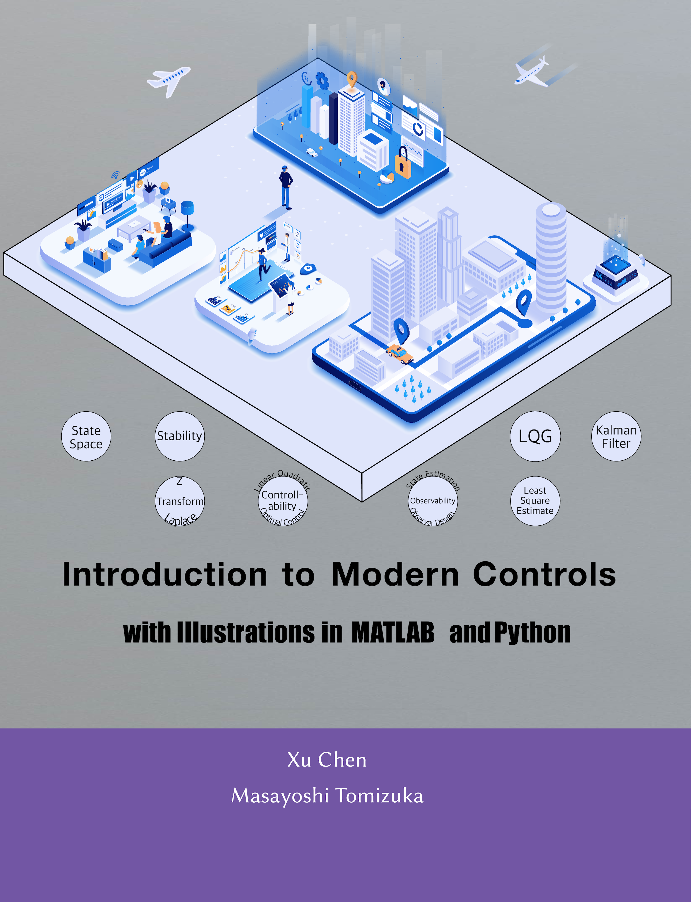

# Introduction to Modern Controls, with Illustrations in Matlab and Python

"Introduction to Modern Controls“ uses modern computing tools such as MATLAB and Python to teach modern control systems. You will learn how to use state-space methods to make, study, and control dynamic systems. You will explore topics like state-space models and solutions, stability, controllability, observability, state-feedback control, optimal control, observers, observer state feedback controls, least square estimation, Kalman filter, and Linear Quadratic Gaussian optimal control. You will see how these topics work in both continuous- and discrete-time settings. Substantial example codes, figures, and illustrations on physical systems supplement your learning.

---

## Links

- [Book website](https://mcimp-book.github.io/mcimp/)
- [ME547 Linear Systems, University of Washington¶](https://faculty.washington.edu/chx/teaching/me547/)
- [ME233 Advanced Control Systems II, UC Berkeley, Spring 2014¶](https://faculty.washington.edu/chx/teaching/advcontrol2/)
- [ME233 Advanced Control Systems II, UC Berkeley, Spring 2016¶](https://berkeley-me233.github.io)
